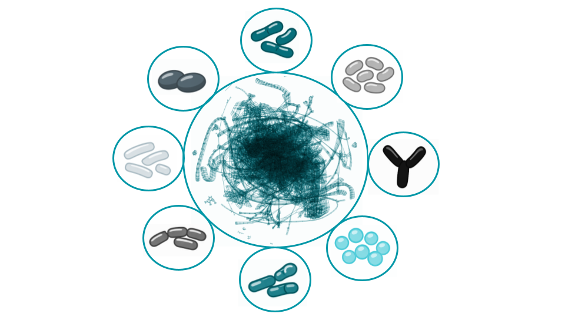

## Complete Atom-to-Atom Mapped Genome-scale metabolic models of the Simplified Human Intestinal Microbiota 

This repository provides genome-scale metabolic models of the Simplified Human Intestinal Microbiota (SIHUMIx) with fully validated atom-to-atom mappings across the entire metabolic network.

These models enable detailed tracing of atomic transitions through biochemical reactions, supporting advanced analyses such as metabolic flux tracing, isotope labeling studies, and mechanistic investigations of microbial metabolism.

## Included Organisms

The dataset includes the following organisms:

* *Anaerostipes caccae*
* *Bacteroides thetaiotaomicron*
* *Bifidobacterium longum*
* *Blautia producta*
* *Clostridium butyricum*
* *Clostridium ramosum*
* *Escherichia coli* K-12
* *Lactobacillus plantarum*

## Model Quality

All models achieve a MEMOTE score of **89%**, indicating high-quality, well-curated, and consistent metabolic reconstructions.

## License

This dataset is licensed under the Creative Commons Attribution 4.0 International (CC BY 4.0).

## Citation

Please cite as:
Beier et al. (2026). Atom-to-Atom Mapped Genome-Scale Models for a Small Gut Microbiome Consortium.
